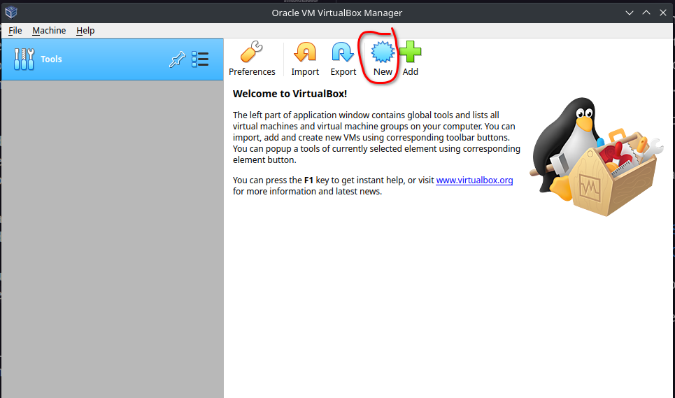
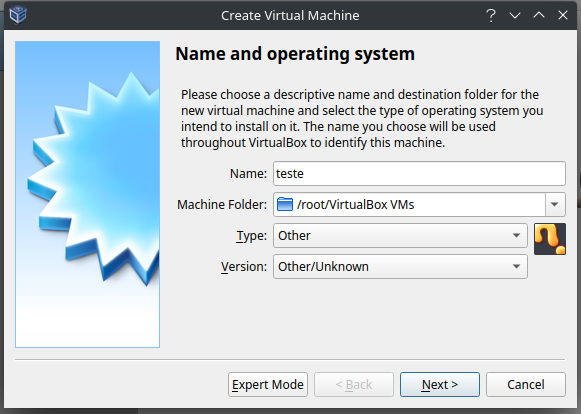
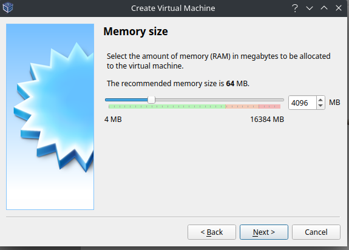
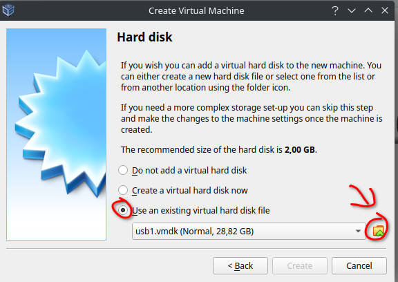
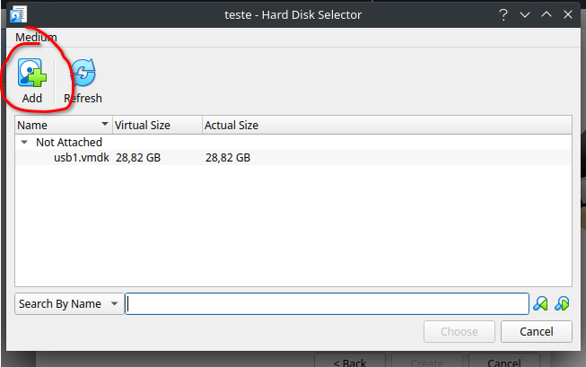
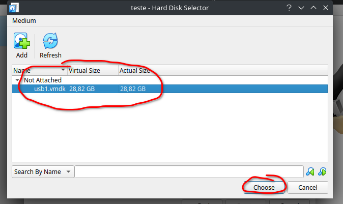
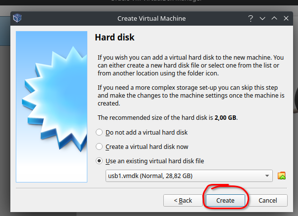
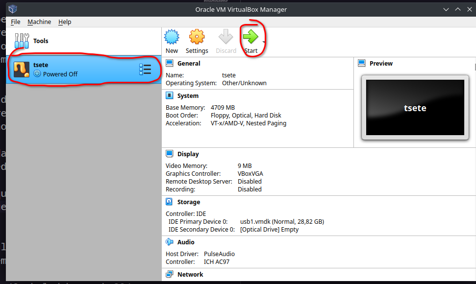
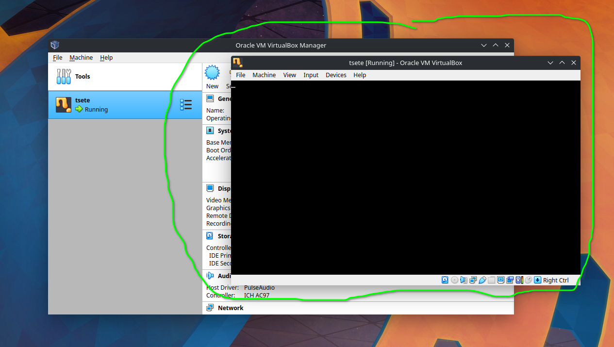

# Aviso Intordutório

|ZERO TO HERO TANTO PARA QUEM LÊ QUANTO PARA MIM... O AUTOR|

# Entendo o que faremos

Criaremos um bootloder para carregar na memória RAM um mini Kernel. Esse Kernelzinho deve conseguir ler do teclado, escrever na tela, ter um sistema de arquivos, baseado no FAT12/16/32, e rodar um terminal que consiga rodar comandos internos e programas que estão nos arquivos.

# Arrumando o ambiente

## Preparando virtualbox

Usar o virtual box para ir testando (bem mais rápido do que ficar resetando o pc):

Instalar no Ubuntu: https://pt.linuxcapable.com/how-to-install-virtualbox-6-1-on-ubuntu-22-04-lts/


Usar um pendrive para bootar no virtualbox.
Como queremos fazer um bootloaderzinho, vamos ir colocando o bootloader no pendrive e bootando o pendrive no virtualbox para testar.
Como colocar o programa bootavel no pendrive ensinarei mais para frente, mas por enquanto o ideal é criar o .vmdk do pendrive usando o comando (LER O PRÓXIMO PARAGRAFO, SEM SER A REFERÊNCIA, ANTES DE DAR O COMANDO):

```
sudo vboxmanage internalcommands createrawvmdk -filename ~/usb1.vmdk -rawdisk /dev/sdbx
```
(Referência do comando https://www.how2shout.com/how-to/virtualbox-virtual-machine-boot-usb.html)

No comando a cima é necessário descobrir qual arquivo representa o pendrive e substituir no lugar de /dev/sdbx.
No caso do meu pc era o ```/dev/sdc1```. Ficando:

```
sudo vboxmanage internalcommands createrawvmdk -filename ~/usb1.vmdk -rawdisk /dev/sdc1
```

Para descobrir onde o pendrive foi montado, temos dois principais métodos:

1 - Sem o pendrive no pc, abra o terminal digite ```ls /dev/sd``` e de enter, vão aparecer os arquivos referentes as outras montagens (hd, ssd, etc).
Agora coloque o pendrivee use o mesmo comando, o sd* novo que aparecer é o pendrive
(possívelmente vão aparecer dois um deles com número e outro sem, acredito que sempre é o com número).

2- Abra o explorador de arquivos (Dolphin no Ubuntu) e encontre o seu pendrive no menu lateral. Clique no botão direito em cima do seu pendrive e
entre em propriedades, procure o 'Mounted from:' ou alguma propriedade que seja /dev/sd**.

Para montar a máqui virtual, abra o virtualbox com o sudo, clique em novo.



Defina um nome, o tipo e a versão como na imagem  abaixo:


Escolha o tamanho da memória (100MB é mais do que o suficiente):


Escolha a opção "User an existing virtual hard disk file" e selecione a pastinha do lado do dropdown:


Clique um add para adicionar um novo hd virtual:

Agora vá até onde você salvou o ```.vmdk``` e abra ele. Tendo adicionado o nosso pendrive, selecione ele e clique em 'chose':


Clique em criar:


Pronto!!! Nossa máquina virtual com o pendrive está pronta. selecione ela e clique em 'Start':



Quando ela acabar de iniciar, deve ser isso que você verá (se o seu pendrive já tiver uma assinatura de boot):



## Ambiente de códigos

Agora vamos instalar o nasm e outras coisas para compilar código em assembly:

```
sudo apt-get install build-essential nasm genisoimage bochs bochs-sdl
```

(Link de referência: https://medium.com/@mekaladahanayaka80/implement-your-own-operating-system-week-01-285b0f7e50d4)


# O que e onde estudar

## Ordem de aprendizado lógica

1. Conceitos básicos de arquitetura ( aqui vamos passar por cima ou vamos indicar alguma coisa)

2. Assembly e C lang

3. Compilação e linkagem

4. Processo de boot

5. Kernel
    - Produção de mini-biblioteca em c
    - Sistemas de arquivos
    - I/O
    - Video

## Ordem otimizada

Aqui vamos tentar resumir e entender o assunto geral para aprender o mínimo possível e ter um resultado mais rápido, vou acabar detalhando mais para que você possa entender:

1. Processo de boot
    -Ideia do real mode
    -Assinatura de boot
    -Bootloader (EM ASSEMBLY)

2. Kernel
    -Produção de mini-biblioteca em c
    -Sistemas de arquivos(FAT)
    -I/O
    -Video

3. (Ver o que faz sentido para entender 1 e 2) Entender de maneira raza
    - Registradores e RAM (Vem junto com o assambly)
    - Talvez Big endian e little endian (Joga na wiki)
    - Se eu lembrar de alguma coisa, coloco aqui.... 

4. Assembly e C lang

    - O mínimo de assembly para mexer com a memória e fazer o bootloader... Como o bootloader é meio manjado, talvez bem pouco, mas vamos ter que acabar usando em C para as bibliotecas. O básico e o que está explicado aqui possivelmente vai ser o suficiente.

    - Aqui vamos usar bastante coisa que não se usa no C normalmente como usar ASSEMBLY em C e "outros tipos" de variáveis.

5. (Intercalando com 4)Compilação e linkagem
    - Entender como alguns "tipos de variáveis" vão se comportar na compilação.
    - Diferênciar um .o de um .bin
    - Meio complicado de explicar, mas linkagem não é muito falado e vamos ter que fazer na mão para conseguir ligar alguns programas de jeito expecífico.

Na parte da arquitetura... vamos ignorar a arquitetura de computadores no geral... kkjkjkjkj (Interessante e vale a pena voltar se quiser), mas coisas como funcionamento profundo de um processador, stack, Bus, sistemas digitais, etc. meio que foda-se.

# Explicação rápida, efetiva e superficial dos tópicos importantes

Essa parte vai ser iniciada nesse ponto de escrita, mas vai ser implementada com o aprendizado... Lembrando que esse é um Zero to Hero tanto para quem tá lendo quanto pra mim... kkkjkjk espero que de certo.

<s>Notas sem importância: Nesse ponto fui arrumr o cabelo e percebi que to ficando calvo mais rápido do que eu imaginava.... ou eu vou no médico... ou em questão de 4 meses terei que raspar o cabelo... ou 3... ou 2... nunca se sabe</s> :-:


## Processo de boot
### Ideia do real mode

Antigamente os processadores eram 16 bits, então pela retrocompatibilidade temos o modo 16bits e ele é usado logo que ligamos o computador. No caso vamos usar ele no nosso programa de boot, então só podemos usar os registradores de 16bits.

### Assinatura de boot

Quando estamos falando de bootar uma máquina, temos que pensar que ela estará lendo de algum dispositivo de armazenamento. Assim, para diferenciar o que é um sistema e o que é apenas armazenmento, usamos a assinatura de boot.

De forma simplificada, temos a BIOS (CI que cuida da iniciação do computador) que consegue carregar os primeiros 512bytes de um dispositivo de armazenamento na memória principal(RAM) e começar a "rodar" eles. Para saber qual desses 512bytes é um bootstrap (***), ela verifica se os últimos dois bytes (511 e 512)  são 0xAA55( como 1 byte são 8bits e tem a sua representação em hexa como 0x00, temos que 0xAA55 são os dois bytes). Como esses dois bytes são armaazenados vamos discutir mais para frente, mas  já aviso que é <b>Little endian</b> ou seja byte 511 recebe 0x55 e 512 0xAA.

### Bootloader (EM ASSEMBLY)

## Kernel
### Produção de mini-biblioteca em c
### Sistemas de arquivos(FAT)
### I/O
### Video

## Entender de maneira raza
### Registradores e RAM (Vem junto com o assambly)
### Talvez Big endian e little endian (Joga na wiki)
### Se eu lembrar de alguma coisa, coloco aqui.... 

## Assembly e C lang

### Comando básicos e explicações rápidas

### Assembly em C e coisas que não se usa

## Compilação e linkagem
### Parmetros importantes de compilação
### Diferênciar um .o de um .bin
### Linkagem


Acho que não vou conseguir acabar esse documento... infelizmente sem tempo

Adendo importantes:

Para compilar um código c pra 32 bits limpo de metadados usar:

```
gcc -march=i386 -mtune=generic -m32 --freestanding -nostdlib -nostartfiles -fno-asynchronous-unwind-tables -fno-pie -c teste.c -o teste.o
```

```
strip --strip-all teste.o
```

```
objcopy -O binary -j .text teste.o teste.raw
```

```
objcopy -I binary -O elf32-i386 -B i389 teste.bin teste.o
```

Se quiser ver o que tem dentro do .o (ele mostra o assembly AT algumaa coisaa que não lembro kkjkjk):

```
objdump -d teste.o
```

Para gerar o binário, é necessário linkar:

```
ld -m elf_i386 -o teste.bin -Ttext 0x0 --oformat binary teste.o
```
obs.: ver quanto arquitetura elf_i386 e -Ttext 0x0 é o offset que provavelmente deve ser mudado

Para gerar o assembly da inter a  partir o binário:

```
ndisasm -b 32 teste.bin > teste.dis
```


